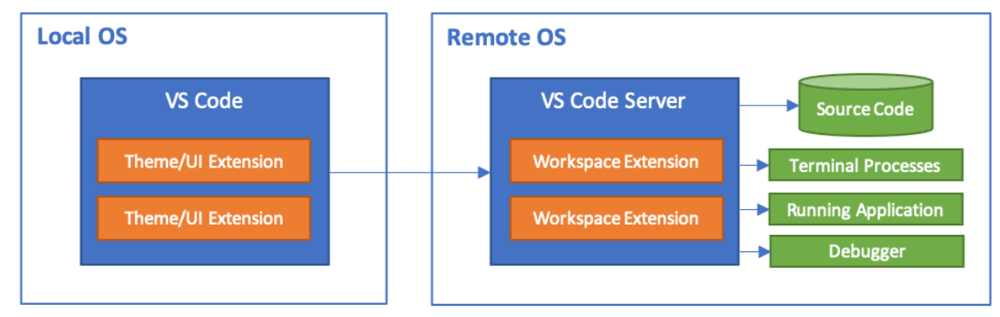
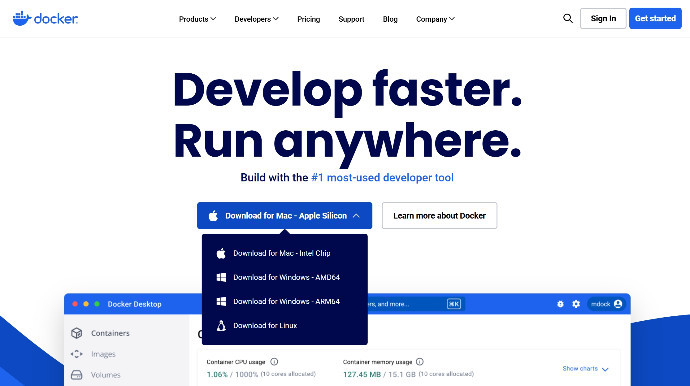
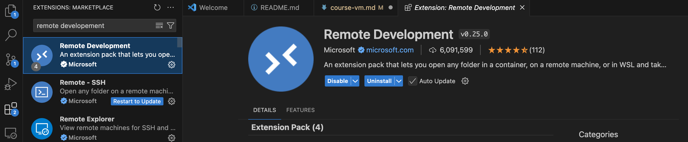
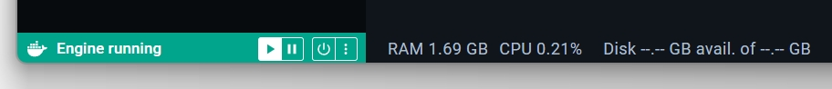
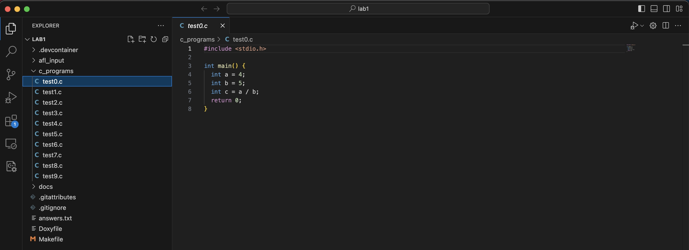
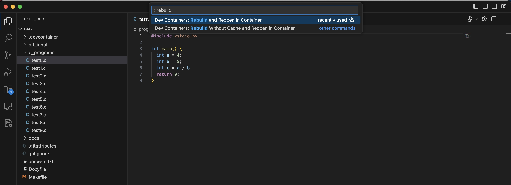
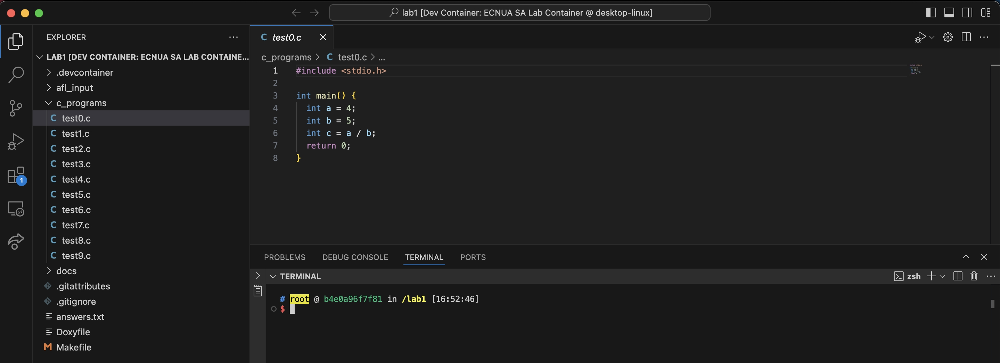
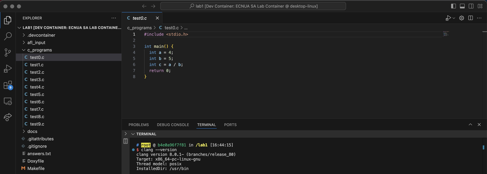
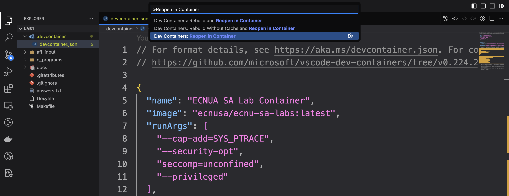
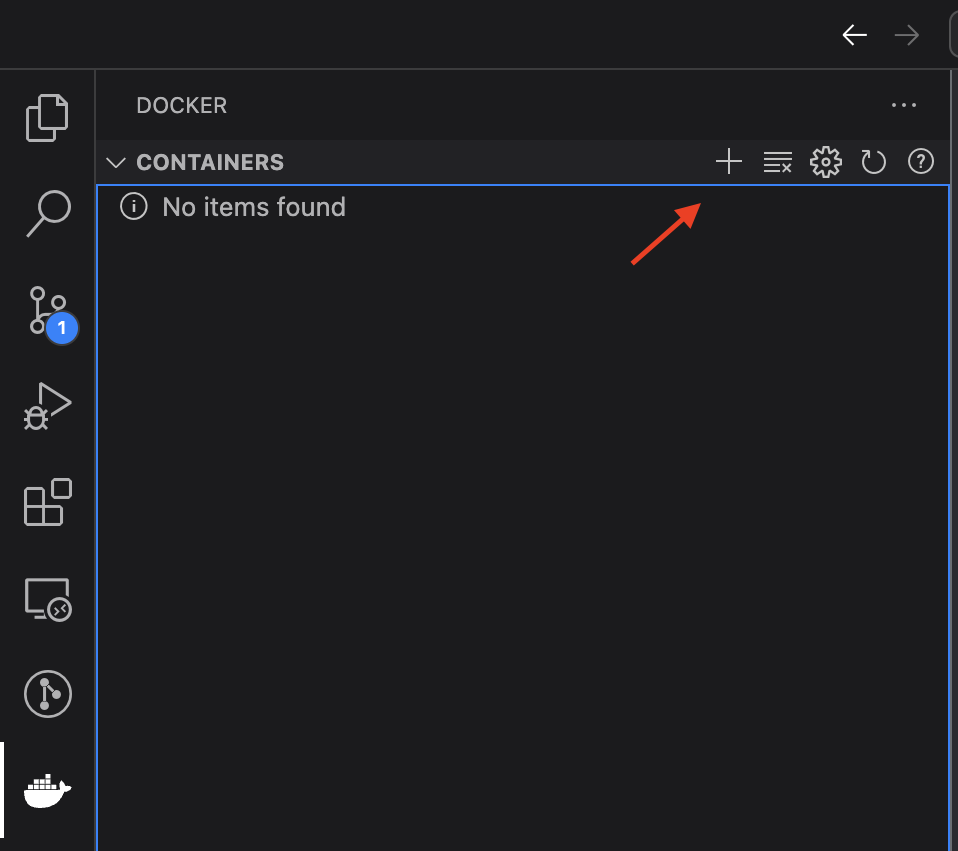

# Setting up Course Lab Environment

Our labs use VScode and Docker containers to build a flexible, consistent and ready-to-use development environment. You can view the picture below to understand the architecture of our lab environment (a.k.a VScode's remote development mode). Conceptually, your local machine (OS) runs VS Code, and the VS code connects to the remote machine (OS) running in a docker container. In this way, you can edits the files in the remote machine via VS code on your local machine, and run all the labs on this remote machine (OS). In the docker container, we have already setup everything (Ubuntu 18.04, LLVM 8.0.1) for you.



**Step1.** For this course, we will use Docker containers with VS Code to ensure everyone uses a consistent development environment for the labs . Before proceeding, you need to install <a href="https://www.docker.com/">docker</a> on your local machine.
Note: for windows users, please select `Download for Windows-AMD64`; For Mac users, please select `Download for Mac`; we will refer to this machine as the host machine. 



**Step2.** After this, install <a href="https://code.visualstudio.com/Download">VS Code</a> and within VS Code install <a href="https://code.visualstudio.com/docs/remote/remote-overview">Remote Development Extension</a>. 



**Step3.** Clone the repository of the course labs on your local machine.
For the course labs, we provide a configuration file (`.devcontainer/devcontainer.json`) in each lab that instructs VS Code how to set up a development environment using an appropriate docker image and various other configuration options. 

About `.devcontainer/devcontainer.json`,
```
"name": "ECNUA SA Lab Container",
"image": "ecnusa/ecnu-sa-labs:latest",
"runArgs": [
	"--cap-add=SYS_PTRACE",
	"--security-opt",`
	"seccomp=unconfined",
	"--privileged"
],

// Set the env-variables for the container.
"remoteEnv": {
	"LD_LIBRARY_PATH": "${containerWorkspaceFolder}/build:${containerEnv:LD_LIBRARY_PATH}"
},
...
```

Before you start working on some lab, please open the Docker. 

<!--  -->


**Step4.** To start working on a lab, open the lab inside VS Code. Note that you need to open the lab folder such as `lab1` or `lab2` in VS Code rather than the `ecnu-sa-labs` folder.





Press the F1 function key to open a search box (Note: Sometimes, it's not the F1 function key). Search and select `Dev Containers:Rebuild and Reopen in Container`. It may take a few minutes, please wait for a while.



This will reload VS Code and set up the development environment. You can now edit, run and debug your lab in VS Code. You can open the terminal in VS code

 

To check whether you have successfully open the lab in the container, you can run `clang --version` in the terminal, and you will get the clang version:





To resume working on a lab, open the lab in VS Code and Search and select `Reopen in Container`. Any changes you make here will be available in your ecnu-sa-labs folder.

<!-- When the F1 key work, you will see..



When the F1 key doesn't work, you can do the following:


 -->
