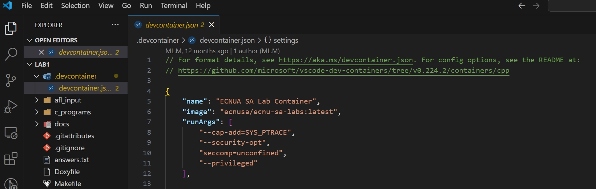
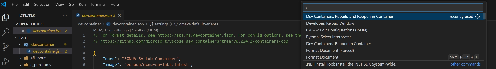
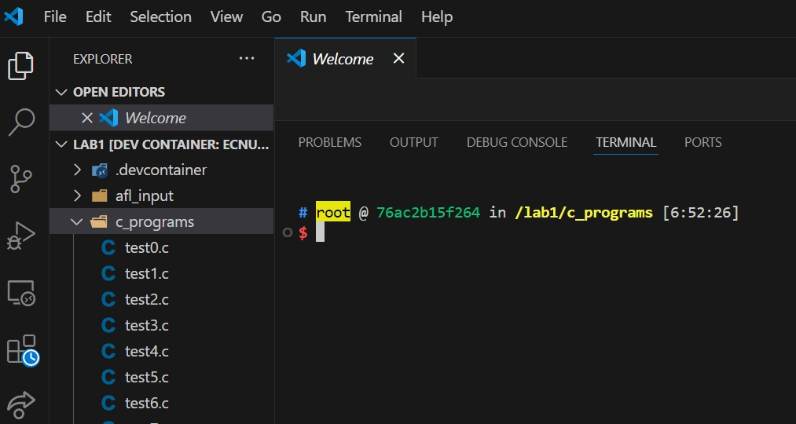
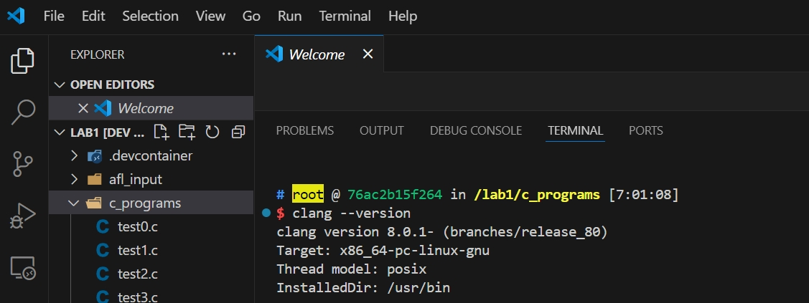

## Setting up Course Lab Environment

**Step1.** For this course, we will use Docker containers with VS Code to ensure everyone uses a consistent development environment for the labs . Before proceeding, you need to install <a href="https://www.docker.com/">docker</a> on your local machine(Note:for windows users, please install ); we will refer to this machine as the host machine. 


**Step2.** After this, install <a href="https://code.visualstudio.com/Download">VS Code</a> and within VS Code install the <a href="https://code.visualstudio.com/docs/remote/remote-overview">Remote Development Extension</a>. 


**Step3.** For the course labs, we provide a configuration file(`.devcontainer/devcontainer.json`) in each lab that instructs VS Code how to set up a development environment using an appropriate docker image and various other configuration options. 

About `.devcontainer/devcontainer.json`,
```
"name": "ECNUA SA Lab Container",
"image": "ecnusa/ecnu-sa-labs:latest",
"runArgs": [
	"--cap-add=SYS_PTRACE",
	"--security-opt",`
	"seccomp=unconfined",
	"--privileged"
],

// Set the env-variables for the container.
"remoteEnv": {
	"LD_LIBRARY_PATH": "${containerWorkspaceFolder}/build:${containerEnv:LD_LIBRARY_PATH}"
},
...
```
Before you start with the labs, make sure that docker engine is running in the background. 

**Note: You will need to open the lab folder such as lab1 or lab2 in VS Code rather than the ecnu-sa-labs folder. **


**Step4.** To start working on a lab, open the lab inside VS Code. Press the F1 function key to open a search box (Note: Sometimes, it's not the F1 function key). Search and select Dev Containers:Rebuild and Reopen in Container. 

This will reload VS Code and set up the development environment. You can now edit, run and debug your lab in VS Code.When the build is complete, select a file within the lab1 folder and open it in terminal.
 
To see if you have successfully open the labs in your container, you can type command `clang --version` in integred terminal, and you will get this:
To resume working on a lab, open the lab in VS Code and Reopen in Container. Any changes you make here will be available in your ecnu-sa-labs folder.

<!-- When the F1 key work, you will see..


When the F1 key doesn't work, you can do the following:


 -->
