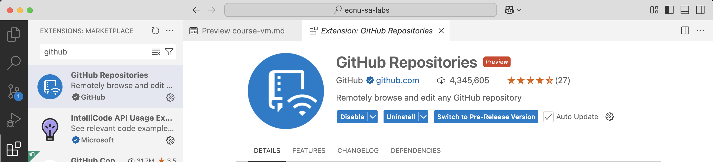

# Setting up course lab environment

Our labs use VScode and Docker containers to build a flexible, consistent and ready-to-use development environment. You can view the picture below to understand the architecture of our lab environment (a.k.a VS Code's remote development mode). Conceptually, your host machine runs VS Code, and the VS code connects to the remote machine running in a docker container. In this way, you can edits the files in the remote machine via VS Code on your host machine, and run all the labs on the remote machine. In the docker container, we have already setup everything for you. 


### The Docker container

- Ubuntu 22.04, LLVM 19

:star: You host machine needs to have at least 15GB disk space and 8GB memory to run the docker container.

### What you need to install?

- [Docker](https://www.docker.com/)
- [VS code](https://code.visualstudio.com/Download)

### Instructions for setting up lab environment

#### Step 1. 
For this course, we will use Docker containers with VS Code to ensure everyone uses a consistent development environment for the labs. Thus, you need to install <a href="https://www.docker.com/">docker</a> on your host machine[^1].


#### Step 2.  
After this, install <a href="https://code.visualstudio.com/Download">VS Code</a> and within VS Code install `Remote Development` from `Extensions`. 


Within VS Code, we also recommend you to install `GitHub Repositories` from `Extensions`. It lets you quickly browse, search, edit, and commit to any remote GitHub repository directly from within Visual Studio Code.



#### Step 3. 
Clone the repository of our respository ([ecnu-sa-labs](https://github.com/ecnu-sa-labs/ecnu-sa-labs)) on your host machine.
In this repository, we provide the labs in the folders like `lab1`, `lab2`, etc.
In each lab, we provide a configuration file `.devcontainer/devcontainer.json`[^2] that instructs VS Code to set up a development environment using an appropriate docker image and various other configuration options. 

Here is an example: `.devcontainer/devcontainer.json`,
```
"name": "ECNUA SA Lab Container",
"image": "ecnusa/ecnu-sa-labs:latest",
"runArgs": [
	"--cap-add=SYS_PTRACE",
	"--security-opt",`
	"seccomp=unconfined",
	"--privileged"
],

// Set the env-variables for the container.
"remoteEnv": {
	"LD_LIBRARY_PATH": "${containerWorkspaceFolder}/build:${containerEnv:LD_LIBRARY_PATH}"
},
...
```

<!-- Before you start working on some lab, please open the Docker. -->

<!--  -->


#### Step 4. 
To start working on a lab, open the lab in a **NEW** VS Code window. 

:star: Note that you need to open the lab folder (e.g., `lab1`) in a new VS Code window.
In VS Code, go to `File`, select `New Window`, find and select the lab folder (e.g., `lab1`) to be open. You should be able to open the lab like the following picture.


Open the Command Palette[^3] in VS Code, and search and select `Dev Containers:Rebuild and Reopen in Container` to setup the lab environment (i.e., building and opeing the container and connecting your host machine to the container which contains the lab). This process may take a few minutes.

:star: Note: If you have encountered some errors when building and opeing the container, one alternative way is to directly pull the <a href="https://hub.docker.com/r/ecnusa/ecnu-sa-labs">ecnu-sa-lab image</a> from <a href="https://hub.docker.com/">docker hub</a>. If you cannot access the docker page, please refer to <a href="https://pan.baidu.com/s/1B7W2EeSUts_k2lzoTnJhDg?pwd=yebz">this link</a> and download the docker image. After decompression, use `docker load -i <path to image tar file> ` to load the image before building in container. ([TODO])


This will reload VS Code and set up the development environment. You can now edit, run and debug your lab in VS Code. You can open the terminal in VS code：

 

To check whether you have successfully open the lab in the container, you can run `clang --version` in the terminal, and you should be able to get the clang version:


If you close the lab in this new window (i.e., your host machine was disconnected from the container), and hope to resume working on the lab.
You can open the lab folder in VS Code again, open the Command Paletteand, and search and select `Reopen in Container`. 

:star: Note: Any changes you have made in the lab folder (in the container) will be available in your ecnu-sa-labs folder (in your host machine).


[^1]: Note: for windows users, please select `Download for Windows-AMD64`; For Mac users, please select `Download for Mac`. If you don't have direct access to <a href="https://www.docker.com/">docker</a>, please refer to <a href="https://pan.baidu.com/s/1B7W2EeSUts_k2lzoTnJhDg?pwd=yebz">this link</a> for download.

[^2]: `devcontainer.json`文件是一个 JSON 格式的配置文件，通常存放在项目根目录下的 `.devcontainer` 文件夹中。它定义了开发容器的配置信息，包括容器的基础镜像、需要安装的工具和扩展、环境变量等。通过这个文件，开发者可以确保项目在不同的开发环境中都能保持一致的运行状态。

[^3]: In VS Code, the Command Palette is a powerful and versatile tool that provides quick access to a wide range of commands. On Windows and Linux, you can open the Command Palette by pressing `Ctrl + Shift + P`. On macOS, use `Command + Shift + P`.
