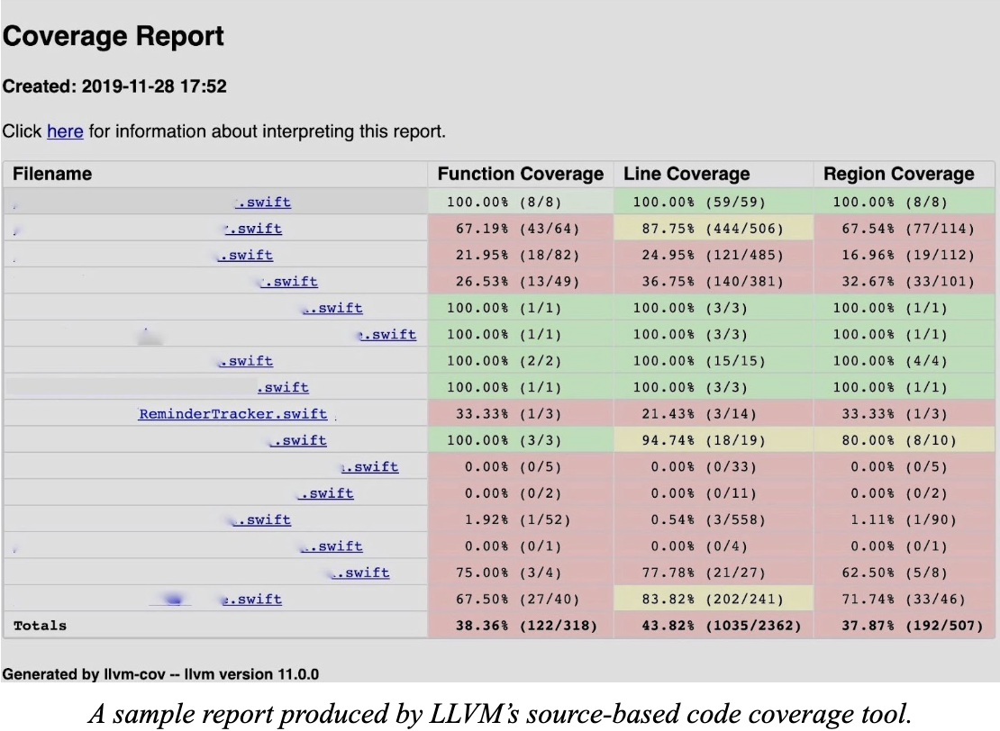

## The LLVM Framework

Building an understanding of the LLVM framework: IR, API, and the toolchain.

### Objective

The objective of this lab is three-fold:
+ Understanding a representation of C programs called [LLVM IR][llvm-lang] that we
will use in our labs.
It is the intermediate representation used by [LLVM][llvm], a popular compiler
framework for a variety of programming languages.
+ Understanding the [LLVM API][llvm-api] by using it to write a [LLVM pass][llvm-pass]
and running it to statically find all the binary operators in a program and
instrument them.
+ Understanding the differences between static and dynamic properties of a program,
by executing instrumented code.

### Pre-Requisites

+ Read the [LLVM Primer][llvm-primer]: Part I (Overview of LLVM) and Part II
(Structure of LLVM IR).
This is required for the first part of this lab as well as throughout the rest
of the course to be able to read LLVM IR for debugging purposes.
+ Keep [LLVM Primer][llvm-primer]: Part III (The LLVM API) at hand as a quick
reference for most of the LLVM API used in this lab and also throughout the course.

### Setup

+ Open the `lab2` folder in VS Code, using the 'Open Folder' option in VS Code.
+ Make sure the Docker is running on your machine.
+ Open the VS Code [Command Palette][command-palette]; search and select `Reopen in Container`.
+ This will set up the development environment for this lab in VS Code.
+ Inside the development environment the skeleton code for Lab 2 will be locate
under `/lab2`.
+ Afterwards, if VS Code prompts you to select a kit for the lab then pick Clang 8.

### Part 1: Understanding the LLVM IR

##### Step 1

Study the [LLVM Primer][llvm-primer] to understand the structure of the LLVM IR.
The primer shows how to run `clang` on a sample C program to generate the
corresponding LLVM IR program.
You can use the C programs under `/lab2/test` directory to try it out:

```sh
/lab2$ cd test
/lab2/test$ clang -emit-llvm -S -fno-discard-value-names -c simple0.c
```

`clang` is a compiler front-end for C that uses LLVM as a back-end.
The user manual of clang has a useful reference to its
[command-line options][clang-cli-opts].
Briefly,
+ `-S` instructs clang to perform preprocessing and compilation steps only
+ `-emit-llvm` instructs the compiler to generate LLVM IR
(which will be saved to simple0.ll)
+ `-fno-discard-value-names` preserves names of values in the generated
LLVM for improving readability.

##### Step 2

Write by hand the C programs corresponding to the LLVM IR programs
under the `/lab2/ir_programs` directory by filling in the provided
template code in the `/lab2/c_programs` directory.
Ensure that running the above command on your hand-written C programs
generates the exact LLVM IR programs provided as we will auto-grade them.
You can do so by using the diff command-line utility to check if your
files are the same.

```sh
/lab2$ cd c_programs
/lab2/c_programs$ clang -emit-llvm -S -fno-discard-value-names -c test1.c
/lab2/c_programs$ diff test1.ll ../ir_programs/test1.ll
```

Alternatively you can let the provided Makefile automatically do this for you:

```sh
/lab2/c_programs$ make test1
```

### Part 2: Understanding the LLVM API

##### Step 1

In this and future labs, we will use `CMake`, a modern tool for managing the
build process.
If you are unfamiliar with `CMake`, you are strongly advised to read the
[CMake tutorial][cmake-tutorial] first (especially Step 1 and Step 2 in the
tutorial).
Running `cmake` produces a Makefile that you might be more familiar with.
If not, read the [Makefile tutorial][makefile-tutorial] before proceeding.
*Once a Makefile is generated, you need only call `make` to rebuild your project
after editing the source files.*
Run the following commands to set up this part of the lab:

```sh
/lab2$ mkdir -p build && cd build
/lab2/build$ cmake ..
/lab2/build$ make
```

You should see several files created in the `lab2/build` directory.
Among other files, this builds two LLVM pass named `DynamicAnalysisPass.so`
and `StaticAnalysisPass.so` from code that we have provided in
`lab2/src/DynamicAnalysisPass.cpp` and `lab2/src/StaticAnalysisPass.cpp`
(you will modify both these files in this lab), and a runtime library,
named `libruntime.so` that provides some functions that are used in the lab.
The remaining steps follow the depicted workflow from left to right:


##### Step 2

As noted in Step 1, you will implement the functionality of this lab as two
LLVM passes called `StaticAnalysisPass` and `DynamicAnalysisPass`.
LLVM passes are subprocesses of the LLVM framework.
They usually perform transformations, optimizations, or analyses on programs.
Each pass operates on the LLVM IR representation of the input program.
So, to exercise this lab on an input C program, you must first compile the
program to LLVM IR, as you did in Part 1:

```sh
/lab2$ cd test
/lab2/test$ clang -emit-llvm -S -fno-discard-value-names -c -o simple0.ll simple0.c -g
```

##### Step 3

Next, we use opt to run the provided StaticAnalysisPass pass on the compiled C program:

```sh
/lab2/test$ opt -load ../build/StaticAnalysisPass.so -StaticAnalysisPass -S simple0.ll -o simple0.static.ll
...
```

`opt` is an LLVM tool that performs analyses and optimizations on LLVM IR.
The option `-load` loads our LLVM pass library while `-StaticAnalysisPass` instructs
opt to run the pass on `simple0.ll`.
(Libraries can and often do contain multiple LLVM passes.)
Consult the [documentation of opt][opt-doc] to understand the potential ways to use
the tool; it may help you build and debug your solutions.
Similarly, we use `opt` to run the provided `DynamicAnalysisPass` pass on the
compiled C program:

```sh
/lab2/test$ opt -load ../build/DynamicAnalysisPass.so -DynamicAnalysisPass -S simple0.ll -o simple0.dynamic.ll
```

The program produced in `simple0.static.ll` should be identical to `simple0.ll`
while the program in `simple0.dynamic.ll` won’t be for this lab.
You can use `diff` to verify this:

```sh
/lab2/test$ diff simple0.static.ll simple0.ll
1c1
< ; ModuleID = 'simple0.ll'
---
> ; ModuleID = 'simple0.c'
/lab2/test$ diff simple0.dynamic.ll simple0.ll
...
```

##### Step 4

Next, compile the instrumented program and link it with the provided runtime
library to produce a standalone executable named `simple0`:

```sh
/lab2/test$ clang -o simple0 -L../build -lruntime simple0.dynamic.ll
```

##### Step 5

Finally run the executable on the empty input; note that you may have to manually
provide test input for programs that expect non-empty input:

```sh
/lab2/test$ ./simple0
```

In this lab, you will add your code to `src/StaticAnalysisPass.cpp` and
`src/DynamicAnalysisPass.cpp`.
The provided `StaticAnalysisPass` reports the location of all instructions in the
program and you will be implementing functionality to report the location, type and
operands of every binary operator in a program.
The provided `DynamicAnalysisPass` modifies the program in a manner such that when
executing the program, it will report whenever an instruction is executed by printing
the line and column number of the instruction to a coverage file.
You will be implementing additional functionality that modifies a program to also
report the location, type and the runtime values of the operands of a binary operator
when it is executed.
We will specify the exact output format in the next section but after completion your
output for `StaticAnalysisPass` on `simple0.c` should be:

```
Running Static Analysis Pass on function main
Locating Instructions
2, 7
2, 7
3, 7
3, 7
4, 7
4, 11
4, 15
4, 13
Division on Line 4, Column 13 with first operand %0 and second operand %1
4, 7
5, 3
```

You may notice here that multiple instructions can have the same location.
We will explore the reasoning behind this later in the document.
After completing `DynamicAnalysisPass`, executing `simple0` should create two files:
`simple0.cov` and `simple0.binops` with the following contents:

```
# simple0.cov
2, 7
2, 7
3, 7
3, 7
4, 7
4, 11
4, 15
4, 13
4, 7
5, 3
# simple0.binops
Division on Line 4, Column 13 with first operand=3 and second operand=2
```

### Lab Instructions

##### Static Analysis
As mentioned previously, you are provided with `src/StaticAnalysisPass.cpp` that
contains one static analysis that reports the location of all instructions in the
program, and you will be adding another analysis to it.
First spend some time to understand the provided analysis that prints out the location
of all Instructions; the LLVM primer will be helpful for understanding the API’s used
here.
Next you will implement a static analysis that prints out the kind, location and the
operands of every instructions of type BinaryOperator and print in the following
format:

```sh
Division on Line 4, Column 13 with first operand %0 and second operand %1
<Operator> on Line <Line>, Column <Col> with first operand <OP1> and second
operand <OP2>
```

You will find the functions `getBinOpSymbol` and `getBinOpName` from `Utils.h`
helpful in doing this, it is recommended that you take a glance at the implementation
of `getBinOpSymbol`.
You can use the `variable` function from `Utils.h` to get the name of an operand from
its corresponding LLVM Value.

##### Dynamic Analysis

It involves inspecting a running program for information about its state and
behavior during runtime; this is in contrast to static analysis which analyzes
the properties of code independent of any execution.
One way to inspect the runtime behavior of a program is by injecting code into
the program during compile time; this technique falls under the umbrella term
[instrumentation][instrumentation-def].
For each static analysis in `src/StaticAnalysisPass.cpp`, we will have a corresponding
dynamic analysis instrumentation in `src/DynamicAnalysisPass.cpp`.
We have provided you with an implementation for the first analysis which injects a
call to `__coverage__` function before every instruction, this function stores the
line and column of the executing instruction to a coverage file.
Study the implementation to understand the APIs used for injecting the function.
You will implement a dynamic analysis that tracks the kind, location as well as the
runtime values of the operands to a binary operator.
For this you will have to check if an instruction is a `BinaryOperator` and instrument
it with the `instrumentBinOpOperands` function, which you will be implementing next.
The `instrumentBinOpOperands` function has to inject calls to `__binop_op__` before
every binary operator.
You can see that `__binop_op__` takes 5 arguments, namely, a symbol for the operator,
the line and column of the operation and the runtime values of the two operands.
You can use the `getBinOpSymbol` function to get the symbol corresponding to the
operator.
In order to get the runtime values of the operands, it is necessary to keep in mind
that in LLVM **a variable defined by an instruction is represented by the
instruction itself**.

##### Code Coverage Primer

Code coverage is a measure of how much of a program’s code is executed in a
particular run.
There are a number of different criterias to describe coverage.
In this lab we are providing line coverage and you are implementing an artificial
criteria of tracking binary operators during the execution of a program using the
same mechanisms underlying modern code coverage tools, such as the LLVM’s source-based
code coverage tool and gcov.
It instruments the program’s LLVM IR instructions at compile-time to record the line
and column number of the program’s source-level instructions that are executed at
run-time.
This seemingly primitive information enables powerful software analysis use-cases.
In the next lab, you will use line coverage information to guide an automated test
input generator, thereby realizing the architecture of modern industrial-strength
fuzzers.



##### Debug Location Primer

When you compile a C program with the `-g` option, LLVM will include debug information
for LLVM IR instructions.
Using the aforementioned instrumentation techniques, your LLVM pass can gather this
debug information for an `Instruction`, and use it in your analysis.
We will discuss the specifics of this interface in the following sections.

##### Instrumentation Pass

We have provided a framework from which you can build your LLVM pass.
You will need to edit the `src/DynamicAnalysisPass.cpp` file to implement features to
your LLVM Pass.
File `lib/runtime.c` contains functions that you will inject using your pass:

```c
void __binop_op__(char c, int line, int col, int op1, int op2);
```

As you will create a dynamic analysis, your pass should instrument the code with calls
to these functions.
In short, to complete `DynamicAnalysisPass` in this lab you have the following high
level tasks:

+ Check for binary operators and instrument it using `instrumentBinOpOperands`.
+ Implement `instrumentBinOpOperands` to insert calls to `__binop_op__`.

##### Inserting Instructions into LLVM code

Once you are familiar with the organization of LLVM IR, LLVM instructions, and the
`Instruction` class after finishing Part 1 and completing static analysis, you can
start working on `DynamicAnalysisPass`, for this you will need to use the LLVM API
to insert additional instructions into a program.
There are [manys ways to do this in LLVM][llvm-insert-inst].
One common pattern when working with LLVM is to create a new instruction and insert
it directly **_before_** some instruction.
For example, consider this code snippet:

```cpp
Instruction* ExistingInstruction = ...;
auto *NewInst = new Instruction(..., ExistingInstruction);
```

A new instruction (`NewInst`) is created and inserted _before_ an existing
Instruction `ExistingInstruction`.
Subclasses of `Instruction` have similar methods for doing this.
In particular, for this lab you can use this pattern to create and insert a call
instruction (`CallInst`), as discussed below.
You should also take a look at how a call instruction was inserted into a program
in the `instrumentCoverage` function, as an example of the instructions below.

##### Loading C functions into LLVM code

We have provided the definition of C functions in the `runtime.c` file for you, but
you have to inject LLVM instructions to call them from instrumented code.
Before a function can be called within a Module, it has to be loaded into the Module
using the appropriate LLVM API [Module::getOrInsertFunction][llvm-insert-function].
One way to do this is illustrated below:

```cpp
M->getOrInsertFunction(FunctionName, return_type, arg1_type, ..., argN_type);
```

Here, `return_type`, `arg1_type`, ... `argN_type`, are variables that describe the
LLVM Type of the arguments to the function.
For example, the C-type `int` is usually the LLVM Type `i32`, and `char` is `i8`,
`boolean` is `i1`.
This step is akin to declaring a function in C or C++.

Next say, you want the function to be called right before some instruction I.
For this you will have to create a call instruction using
[CallInst::Create][callinst-create] as illustrated below:

```cpp
Instruction I = ...;
auto *NewFunction = M->getFunction(FunctionName);
CallInst::Create(NewFunction, Args, "", &I);
```

Here, you should populate `std::vector<Value *> Args` with appropriate values for
arguments to the function.
Additionally as previously stated, in LLVM, a variable defined by an instruction is
represented by the instruction itself.
Furthermore, the `Instruction` class is a subclass of the `Value`; this makes
passing a variable defined by an Instruction to a function as an argument
relatively straightforward.

##### Debug Locations

As we alluded previously, LLVM will store code location information of the
original C program for LLVM instructions when compiled with `-g`.
This is done through the DebugLoc class:

```cpp
Instruction* I = ...;
DebugLoc Debug = I->getDebugLoc();
printf("Line No: %d\n", Debug.getLine());
```

You will need to gather and forward this information to the appropriate functions.
Not every single LLVM instruction corresponds to a specific line in its C source code.
So before using debug information, you generally need to check if an Instruction
actually has it.

### Understanding Static and Dynamic Properties of Code

Code has two types of properties, static and dynamic.
Static properties are things that can be inferred from the source representation of
the code and are independent of any specific run of the program.
On the other hand, behavior of code during runtime is captured by its dynamic
properties.
In Part 2, you implement a LLVM pass that statically finds all the binary operators
and its operands; you also implement a LLVM pass that instruments all binary operators
to collect the dynamic property describing which binary operators are executed in a
given run of a program, in what order, and with what operands.
Both static and dynamic properties tell us interesting facts about a program that can
be leveraged in various ways.
In particular, for this course we shall use them to find bugs in a program.

### Submission

Once you are done with the lab, you can create a `submission.zip` file by using
the following command:

```sh
/lab2$ make submit
...
submission.zip created successfully.
```

Then upload the `submission.zip` file to TA's email.

[llvm-primer]: https://tingsu.github.io/files/courses/llvm-framework-primer.pdf
[llvm-lang]: https://llvm.org/docs/LangRef.html
[llvm-api]: https://releases.llvm.org/8.0.1/docs/index.html
[llvm-pass]: https://llvm.org/docs/WritingAnLLVMPass.html
[llvm]: https://llvm.org
[command-palette]: https://code.visualstudio.com/docs/getstarted/tips-and-tricks#_command-palette
[clang-cli-opts]:https://releases.llvm.org/8.0.0/tools/clang/docs/UsersManual.html#command-line-options
[cmake-tutorial]: https://cmake.org/cmake/help/latest/guide/tutorial/index.html
[makefile-tutorial]: https://www.gnu.org/software/make/manual/html_node/Simple-Makefile.html#Simple-Makefile
[opt-doc]: https://releases.llvm.org/8.0.0/docs/CommandGuide/opt.html
[instrumentation-def]: https://en.wikipedia.org/wiki/Instrumentation_(computer_programming)
[llvm-insert-inst]: https://releases.llvm.org/8.0.0/docs/ProgrammersManual.html#creating-and-inserting-new-instructions
[llvm-insert-function]: https://llvm.org/doxygen/classllvm_1_1Module.html#a89b5f89041a0375f7ece431f29421bee
[callinst-create]: https://llvm.org/doxygen/classllvm_1_1CallInst.html#a850d8262cd900958b3153c4aa080b2bb