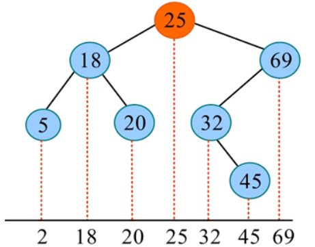

# Metamorphic Testing and Property-based Testing

## Objective

In this experiment, you shall apply your knowledge of **Metamorphic Testing and Property-based Testing** to write properties using Python and **Hypothesis**, thereby testing the implementation of **a binary search tree**.

## Setup

Please ensure that the Python environment contains the packages `pytest` and `hypothesis` listed in `lab4\requirements.txt`. If they are not present, you can install them using the following command: 

```bash
/lab4$ pip list | grep -e pytest -e hypothesis # Check whether pytest and hypothesis are exist
/lab4$ pip install -r requirements.txt  	    # Install the required packages
```

## Prerequisite knowledge

### Binary Search Tree (BST)

A binary search tree (BST), is a special type of binary tree used for both searching and sorting.

A binary search tree is either an empty tree or a binary tree satisfying the following properties:

+ If its left subtree is non-empty, then all nodes in the left subtree have values less than the root's value;
+ If its right subtree is non-empty, then all nodes in the right subtree have values greater than the root's value;
+ Both its left and right subtrees are themselves binary search trees.

Characteristics of a binary search tree: Left subtree < root < right subtree. The in-order traversal sequence of a binary search tree is an increasing sequence. For example, consider a binary search tree whose in-order traversal sequence is shown in the diagram below.

<div align="center">

</div>

The fundamental operations of a binary search tree include `insert`, `delete`, `find`, `union`. Its data structure is implemented in `/lab4/src/BST.py`. Should you require clarification on its implementation principles, please refer to [Binary Search Trees & Balanced Trees - OI Wiki](https://oi-wiki.org/ds/bst/).

The following section will cover operations related to binary search trees. Should you be thoroughly familiar with these concepts, you may skip ahead; however, please review the source code in `/lab4/src/BST.py` to ensure you can write the properties appropriately. You should pay attention to the **`NOTE` sections in the source code** and the bolded parts of the following operations, as these pertain to the structure of the binary search tree in this experiment.

#### find

Find the value of the node with $key2$ in the tree rooted at the root node $(key1, value1)$.

+ If root is empty, directly return `NIL`.
+ If  $𝑘𝑒𝑦1 > 𝑘𝑒𝑦2$ , search the left subtree of root.
+ If  $𝑘𝑒𝑦1<𝑘𝑒𝑦2$, search the right subtree of the root.
+ If  $𝑘𝑒𝑦1==𝑘𝑒𝑦2$, return the $value$ of the root.

```python
def find(self, key: K) -> Optional[V]:
    if self.is_leaf():
        return None

    if self.key() > key:
        return self.get_left().find(key)
    elif self.key() < key:
        return self.get_right().find(key)

    return self.value()
```

#### insert

Insert a node $(key2, value2)$ into a binary search tree rooted at node $(key1, value1)$, Where $key$ denotes the key for comparison and $value$ represents the corresponding value. The classification is as follows:

+ If root is empty, directly return the new node $(key2, value2)$.
+ If  $𝑘𝑒𝑦1 > 𝑘𝑒𝑦2$ , insert the node $(𝑘𝑒𝑦, 𝑣𝑎𝑙𝑢𝑒)$ into the left subtree of root.
+ If  $𝑘𝑒𝑦1<𝑘𝑒𝑦2$, insert the node $(𝑘𝑒𝑦,𝑣𝑎𝑙𝑢𝑒)$ into the right subtree of the root.
+ If  $𝑘𝑒𝑦1==𝑘𝑒𝑦2$, **overwrite the root's original weight**, i.e. the current node's weight changes from $𝑘𝑒𝑦1$ to $𝑘𝑒𝑦2$.

**The insertion principle in this experiment is "the last insertion wins"**

```python
def insert(self, key: K, value: V) -> "BST[K,V]":
    branch = BST(left = BST.nil(), entry = (key, value), right = BST.nil())
    return self._insert_branch(branch)

def _insert_branch(self, branch: "BST[K,V]") -> "BST[K,V]":
    if self.is_leaf():
        return branch

    if self.key() > branch.key():
        return BST(
            left = self.get_left()._insert_branch(branch),
            entry = self._entry,
            right = self.get_right()
        )
    elif self.key() < branch.key():
        return BST(
            left = self.get_left(),
            entry = self._entry,
            right = self.get_right()._insert_branch(branch)
        )
    # NOTE: If the keyword is identical, the newly inserted weight shall be replaced with the original value.
    return BST(
        left = self.get_left(),
        entry = branch._entry,
        right = self.get_right()
    )
```

#### delete

Delete a node with key 𝑘𝑒𝑦 from a binary search tree rooted at node root. Following the same search sequence as insertion, first locate the node with $key$ within the binary search tree. The classification and discussion proceed as follows:

- If the root doesn't have any children, then delete it.

+ If the root has only one child, return that child.

+ If the root has two non-empty child nodes, **replace it with the minimum value node of its right subtree (the leftmost node in the right subtree), and append its left subtree**, and then remove it.

```python
    def delete(self, key:K) -> "BST[K,V]":
        if self.is_leaf():
            return self
        
        if self.key() > key:
            return BST(
                left = self.get_left().delete(key),
                entry = self._entry,
                right = self.get_right()
            )
        
        elif self.key() < key:
            return BST(
                left = self.get_left(),
                entry = self._entry,
                right = self.get_right().delete(key)
            )
        
        if self.get_left().is_leaf():
            return self.get_right()
        if self.get_right().is_leaf():
            return self.get_left()
        # NOTE: If there are two children, replace the original position with the right child and insert the left child into the right child.
        return self.get_right()._insert_branch(self.get_left())
```

#### union

It should be noted that since keys are unique in the binary tree, **nodes with identical keys will have their values updated**. In this experiment, the merge operation corresponds to `union(bst1, bst2)`. For matching keys, the value from `bst1` will overwrite that of `bst2`.

```python
def union(bst1: "BST[K,V]", bst2: "BST[K,V]") -> "BST[K,V]":
    # NOTE: When the key-value pair is identical, the value in BST1 shall replace the value in BST2.
    result = bst2
    for key, value in bst1.to_list():
        result = result.insert(key, value)
    return result
```

### Hypothesis

Hypothesis is a Python testing library based on property-based testing. It verifies general properties of code by automatically generating test data, rather than relying solely on specific test cases.

```python
# Traditional testing
def test_addition():
    assert 1 + 1 == 2
    assert 2 + 2 == 4
    assert -1 + 1 == 0
    
# Hypothesis property-based test
from hypothesis import given, strategies as st
@given(st.integers(), st.integers())
def test_addition_commutative(a, b):
    assert a + b == b + a  # Verify the commutative law
```

#### Strategies

Strategies form the core of Hypothesis, serving to generate test data:

```python
# Basic Type
st.integers()           # integer
st.floats()             # floating-point number  
st.text()               # Text
st.booleans()           # Boolean value

# Complex type
st.lists(st.integers()) # List of integers
st.dictionaries(st.text(), st.integers())  # Dictionary
st.tuples(st.integers(), st.text())        # Tuple

# Custom policy
st.one_of(st.integers(), st.text())        # One of several types
```

In this experiment, the following strategies have been designed for you:

+ Keys: `keys_strategy`, predominantly selected from the range [-25, 25] to ensure test keys predominantly appear in the tree, primarily testing core functionality; with a minor probability of selecting random integers to account for edge cases.
+ Values: `st.integers()`, utilising random integers.
+ BST: `trees_strategy`, executes insert operations using the generated [Key, Value] pairs to construct the tree, with node count constrained between [0,50] and ensuring key uniqueness.

```python
keys_strategy = st.one_of(st.integers(min_value = -25, max_value = 25), st.integers())

def build_bst_from_tuples(kv_list: List[Tuple[int,int]]) -> BST[int,int]:
    bst: BST[int,int] = BST.nil()
    for k, v in kv_list:
        bst = bst.insert(k, v)
    return bst

trees_strategy = st.lists(
    st.tuples(keys_strategy, st.integers()),
    min_size = 0,
    max_size = 50,
    unique_by = lambda kv: kv[0]
).map(build_bst_from_tuples)
```

#### Assumptions

In property testing, assumptions may be employed to constrain the range or attributes of input data. If an assumption is unsatisfied, Hypothesis will automatically generate other input data that satisfies the assumption for testing. Assumptions are typically declared using the `assume()` function.

```python
from hypothesis import given, assume

@given(st.integers())
def test_positive_numbers(a):
    assume(a > 0)  # Ensure that a must be greater than zero.
    assert is_positive(a)
```

#### Shrinking

Hypothesis also offers a feature called shrink. When a property test fails, Hypothesis attempts to find a smaller input data set to make it easier to understand why the test failed.

## Lab Introduction

### Project Structure

```bash
.
|-- bugs
|   |-- __init__.py
|   |-- bug1.py # Bugs has been inserted into both find and union for detection by test1.
|   |-- bug2.py # Bugs has been inserted into both the delete and union for detection by test2.
|   |-- bug3.py # Bug has been introduced in the delete function for detection by test3.
|   `-- bug4.py # Bugs has been inserted into both the delete and union operations for detection by test4.
|-- requirements.txt
|-- src
|   |-- BST.py # Correct implementation of the BST data structure
|   |-- BSTUtils.py # Related utility functions
|   `-- __init__.py
`-- tests
    |-- conftest.py # Runtime Environment Configuration and Test Report Generation
    |-- hypothesis.ini # Hypothesis configuration
    |-- makefile # Run the scripts, including all, clean, test1, test2, test3, test4
    |-- simple_test.py # simple test for BST
    |-- test1.py # TODO: Write Validity Properties tests for find and delete.
    |-- test2.py # TODO: Write Postcondition Properties tests for delete and union.
    |-- test3.py # TODO: Write Metamorphic Properties tests for delete and union.
    `-- test4.py # TODO: Write Model-based Properties tests for delete and union.
```

### Traget

1. TODO1:  Write **Validity Properties** tests for find and union respectively to identify two bugs in `\bugs\bug1.py`:

   + BUG(1) In `find`: During the search, the right subtree will be mistakenly treated as the left subtree.

   + BUG(2) In `union`: Do not compare keys for merging; instead, directly attach it as the left subtree — this will violate the condition left < root < right.

2. TODO2: Write **Postcondition Properties** tests for delete and union respectively to identify tow bugs in `\bugs\bug2.py`:

   + BUG(1) In `delete`: Path error when locating the key
   + BUG(2) In `union`: The values in bst2 are merged into bst1, keys in bst2 take precedence over keys in bst1 (contrary to design intent)

3. TODO3: Write **Metamorphic Properties** tests for delete and union respectively to identify one bugs in `\bugs\bug3.py`:

   + BUG(1) In `delete`: Path error when locating the key
   + **Note that there are no insertion bugs in unions, but writing metamorphic properties for unions is prone to errors and readily detects bugs.**

4. TODO4: Write **Model-based Properties** tests for delete and union respectively to identify one bugs in `\bugs\bug4.py`:

   + BUG(1) In `delete`: Seeking the opposite path.
   + BUG(2) In `union`: The values in bst2 are merged into bst1, keys in bst2 take precedence over keys in bst1 (contrary to design intent).

### Execution

PyTest is a powerful and flexible Python testing framework. Its core objective is to make testing straightforward, readable, and scalable. `lab4\tests\simple_test.py` contains a straightforward basic test for BST which you can run as follows:

```bash
/lab4/tests$ pytest -v simple_test.py --tb=short # Detailed Mode
/lab4/tests$ pytest -q simple_test.py --tb=no # Simple Mode
```

Relevant pytest parameters can be viewed from [pytest](https://pytest.cn/en/stable/).

You may run files such as test1.py in the same manner, and the makefile we provide facilitates their execution.

```bash
/lab4/tests$ pytest -v test1.py --tb=short # Detailed Mode
/lab4/tests$ pytest -q test1.py --tb=no # Simple Mode
/lab4/tests$ make test1 # the smame to simple mode instruction
```

You can execute all files from test1.py to test4.py and clear the cache using the following command:

```bash
/lab4/tests$ make all # execute test1.py to test.py
/lab4/tests$ make clean # Clear the cache and restore the workspace
```

The execution results will be displayed in the terminal, and a test report will be generated in `/lab4/tests/report`. This report contains detailed assert information and minimised test cases for failure.

It is worth noting that the hypothesis includes built-in **sharding operations**, which simplify complex examples. For this experiment, the objective is to minimise the number of nodes while maximising the proximity of values to zero. Consequently, **most failed examples involve 0, -1, 1, and NIL**.

```tex
File and Function: test1.py::test_find_valid

Exception Info:
<ExceptionInfo AssertionError('assert False\n +  where False = is_valid(BST((1, 0), BST((0, 0), NIL, NIL), BST((0, 0), NIL, NIL)))') tblen=30>

Failure Message:
E   assert False
     +  where False = is_valid(BST((1, 0), BST((0, 0), NIL, NIL), BST((0, 0), NIL, NIL)))
    Falsifying example: test_find_valid(
        key=0,
        bst=build_bst_from_tuples([(1, 0), (0, 0)]),
    )
    Explanation:
        These lines were always and only run by failing examples:
            /lab4/bugs/bug1.py:171
            /lab4/bugs/bug1.py:172
            /lab4/bugs/bug1.py:173
            /lab4/src/BSTUtils.py:39
```

The aforementioned report explains that test_find_valid in `test1.py` uncovered a bug, triggered by the assertion: `is_valid(BST((1, 0), BST((0, 0), NIL, NIL), BST((0, 0), NIL, NIL)))`. The minimal test case triggering the bug is: `test_find_valid(key=0, bst=build_bst_from_tuples([(1, 0), (0, 0)]))`.This information will better assist you in understanding and writing about nature.

## Lab Instructions

### Validity Properties

#### Knowledge of Validity Properties

Many data-structures need to satisfy **invariant properties**, above and beyond being well-typed, and binary search trees are no exception: the keys in the tree should be ordered. In this section, we shall see how to write properties that check that this invariant is preserved by each operation.

We find that a **invariant property: all the keys in a left subtree must be less than the key in the node, and all the keys in the right subtree must be greater**.

You can verify whether a binary search tree is satisfy the invariant properties using the `is_valid` function in `lab4\src\BSTUtils.py`. 

```python
def is_valid(bst: BST[K,V]) -> bool:
    if bst.is_leaf():
        return True
    root_key = bst.key()
    left = bst.get_left()
    right = bst.get_right()

    if not is_valid(left) or not is_valid(right):
        return False
    if any(k > root_key for k in left.keys()):
        return False
    if any(k < root_key for k in right.keys()):
        return False
    return True
```

Now it is straightforward to define properties that check that every operation that constructs a tree, constructs a valid one:

Clearly, we must verify that the tree remains valid after inserting a value node or removing a node.

```python
# An empty tree is a valid binary search tree.
def test_nil_valid() -> None:
    assert is_valid(BST.nil())


# After inserting a key-value pair, the result remains a valid BST.
@given(keys_strategy, st.integers(), trees_strategy)
def test_insert_valid(key: int, value: int, bst: BST[int,int]) -> None:
    # assume(is_valid(bst))
    assert is_valid(bst.insert(key, value))

# After deleting a key, the result remains a valid BST.
@given(keys_strategy, trees_strategy)
def test_delete_valid(key: int, bst: BST[int,int]) -> None:
    # assume(is_valid(bst))
    assert is_valid(bst.delete(key))
```

However, these properties, by themselves, do not provide good testing for validity. To see why, let us plant a bug in `insert`, so that it creates duplicate entries when inserting a key that is already present. Property `insert_valid` fails as it should, but so do `delete_valid`. But there is no bugs in `delete`, because the original tree was invalid, so these reported failures are **"false positives"**.

Therefore, before verifying the validity of an operation, it is necessary to ensure that the tree being operated upon is valid, i.e. `assume(is_valid(bst))`, which would discard invalid test cases (not satisfying the precondition) without running them, and thus make the properties pass. 

```python
@given(keys_strategy, trees_strategy)
def test_delete_valid(key: int, bst: BST[int,int]) -> None:
    assume(is_valid(bst))
    assert is_valid(bst.delete(key))
```

This is potentially inefficient (we might spend much of our testing time discarding test cases), but it is also really just applying a sticking plaster: what we want is that all generated trees should be valid! We can test this by defining an additional property:

```python
@given(trees_strategy)
def test_strategy_valid(bst: BST[int,int]) ->None:
    assert(is_valid(bst))
```

which at first sight seems to be testing that all trees are valid, but in fact tests that all trees generated by the Arbitrary instance are valid. If this property fails, then it is the generator that needs to be fixed — there is no point in looking at failures of other properties, as they are likely caused by the failing generator. Usually the generator for a type is intended to fulfill its invariant, but — as in this case — is defined independently. A property such as `test_strategy_valid` is essential to check that these invariant properties are mutually consistent.

**Summary: Validity testing consists of defining a function to check the invariants of your datatypes, writing properties to test that your generators and shrinkers only produce valid results, and writing a property for each function under test that performs a single random call, and checks that the return value is valid.**

#### Need To Do

Now, write **Validity Properties** tests for `find` and `delete` respectively to identify tow bugs in `\bugs\bug1.py`.

After that, Run the following command to detect whether the two bugs in `lab4\bugs\bug1` concerning `find` and `union` have been identified.

```bash
lab4\tests$ make test1
lab4\tests$ pytest -v test1.py --tb=short # More detailed output
```

You should obtain the following result and get the assert information and sharking test seed in `lab4\report\test1`:

```tex
Run Validity Testing (test1.py)...
...FF
FAILED test1.py::test_find_valid - assert False
FAILED test1.py::test_union_valid - assert False
2 failed, 3 passed in 1.12s
```

### Postconditions Testing

#### Knowledge of Postconditions Testing

A postcondition is a property that should be True after a call, or (equivalently, for a pure function) True of its result. Thus, we can define properties by asking ourselves “What should be True after calling f?”. For example, after calling `insert`, then we should be able to `find the key just inserted, and any previously inserted keys with unchanged values.

```python
# Insertions should not affect the search results of other keys (including themselves).
@given(keys_strategy, st.integers(), trees_strategy, keys_strategy)
def test_insert_post(key: int, value: int, bst: BST[int,int], search_key:int) -> None:
    found = bst.insert(key, value).find(search_key)
    expected = value if key == search_key else bst.find(search_key)
    assert found == expected
```

When considering how to design the postcondition for `find`, an obvious approach is to return the corresponding value if the key exists in the tree, or return None otherwise. However, this would be indistinguishable from replicating the `find` functionality itself, and replicating existing functionality is costly and counterproductive. Therefore, **avoid replicating your code in your tests.** We can finesse this problem using a very powerful and general idea, that of constructing a test case whose outcome is easy to predict. In this case, we know that a tree must contain a key `key`, if we have just inserted it. Likewise, we know that a tree cannot contain a key `key`, if we have just deleted it. Thus we can write two postconditions for `find`, covering the two cases:

```python
# After insertion, the lookup should return the inserted value.
@given(st.integers(), st.integers(), trees_strategy)
def test_find_post_present(key: int, value: int, bst: BST[int,int]) -> None:
    assert bst.insert(key, value).find(key) == value

# After deletion, the lookup should return None.
@given(st.integers(), trees_strategy)
def test_find_post_absent(key: int, bst: BST[int,int]) -> None:
    assert bst.delete(key).find(key) is None
```

**Summary: A postcondition tests a single function, calling it with random arguments, and checking an expected relationship between its arguments and its result.**

#### Need To Do

Following the approach of `insert`，Write **Postcondition Properties** tests for `delete` and `union` respectively to identify tow bugs in `\bugs\bug2.py`.

For `delete`, deletion should not affect the search results for other keys.

For `union`, after merging, the lookup should return the correct value, with keys from bst1 taking precedence over keys from bst2.

After that, Run the following command to detect whether the two bugs in `lab4\bugs\bug2` concerning `delete` and `union` have been identified.

```bash
lab4\tests$ make test2
lab4\tests$ pytest -v test2.py --tb=short # More detailed output
```

You should obtain the following result and get the assert information and sharking test seed in `lab4\report\test2`:

Note: no bug has been introduced in the find function; the incorrect find determination is due to an error in the delete operation.

```bash
Run Postconditions Testing (test2.py)...
.F.FF                                                                                       
FAILED test2.py::test_find_post_absent - assert 0 is None
FAILED test2.py::test_delete_post - assert 0 == None
FAILED test2.py::test_union_post - assert 1 == 0
3 failed, 2 passed in 4.10s
```

**Warning: We shall verify whether your code logic complies with the specifications outlined in TODO. Should your approach be bug-oriented or answer-oriented, points will be deducted accordingly.**

### Metamorphic Testing

#### Knowledge of Metamorphic Testing

Metamorphic testing is a successful approach to the oracle problem in many contexts. The basic idea is this: even if the expected result of a function call such as `tree.insert(key, value)` may be difficult to predict, we may still be able to express an expected relationship between this result, and the result of a related call. In this case, if we insert an additional key into `tree` before calling `insert(key, value)`, then we expect the additional key to appear in the result also. We formalize this as the following metamorphic property:

```python
# The relationship between the two insertion operations on (key1, value1) and (key2, value2) and the expected result
# If the key is identical, insert value2 (rather than value1); otherwise, insert both value1 and value2.
# the equivalent determining whether trees are equivalent while disregarding their structure
@given(keys_strategy, st.integers(), keys_strategy, st.integers(), trees_strategy)
def test_insert_metamorph_by_insert(key1: int, value1: int, key2: int, value2: int, bst: BST[int,int]) -> None:
    inserted = bst.insert(key1, value1).insert(key2, value2)
    expected = bst.insert(key2, value2) if key1 == key2 else bst.insert(key2, value2).insert(key1, value1)
    assert equivalent(inserted, expected)
```

`equivalent` is implemented in `lab4\src\BSTUtils`, serving to determine whether trees are equivalent while **disregarding their structural composition**.

```python
def equivalent(bst1: BST[K,V], bst2: BST[K,V]) -> bool:
    return set(bst1.to_list()) == set(bst2.to_list())
```

Note that the following logic is incorrect; please carefully compare it with the distinctions outlined above, The insertion principle in this experiment is **"the last insertion wins"**:

```python
@given(keys_strategy, st.integers(), keys_strategy, st.integers(), trees_strategy)
def test_insert_metamorph_by_insert(key1: int, value1: int, key2: int, value2: int, bst: BST[int,int]) -> None:
    inserted = bst.insert(key1, value1).insert(key2, value2)
    # The priority of value1 and value2 has not been considered.
    expected = bst.insert(key2, value2).insert(key1, value1)
    assert equivalent(inserted, expected)
```

**Summary: A metamorphic property tests a single function by making (usually) two related calls, and checking the expected relationship between the two results.**

#### Need To Do

Following the approach of `insert`, write **Metamorphic Properties** tests for `delete` and `union` respectively to identify one bugs in `\bugs\bug3.py`.

For `delete`: To verify the outcome of the delete operation, one may establish a relationship between `delete.insert` and `insert.delete` by **adding an insert**. That is, by inserting before and after the deletion, one can determine whether the tree structures are equivalent.

For `union`: To verify the outcome of the union operation, one may establish a relationship by **adding an insert**. **Please note that we have not introduced bugs into the union, but the metamorphic properties of this union are prone to errors in implementation. Correct properties will not detect bugs.**

After that, Run the following command to detect whether the two bugs in `lab4\bugs\bug3` concerning `delete` and `union` have been identified.

```python
lab4\tests$ make test3
lab4\tests$ pytest -v test3.py --tb=short # More detailed output
```

You should obtain the following result and get the assert information and sharking test seed in `lab4\report\test3`:

```tex
Run Metamorphic Testing (test3.py)...
.F.                                                                                         
FAILED test3.py::test_delete_metamorph_by_insert - assert False
1 failed, 2 passed in 2.62s
```

**Warning: We shall verify whether your code logic complies with the specifications outlined in TODO. Should your approach be bug-oriented or answer-oriented, points will be deducted accordingly.**

### Model-based Properties Testing

In 1972, Hoare published an approach to proving the correctness of **data representations**(C. A. Hoare. Proof of correctness of data representations. Acta Inf., 1(4):271–281, December 1972.), by relating them to **abstract data** using **an abstraction function**.

In this experiment:

+ date representation: BST
+ abstraction function: `BST::to_list()`
+ abstract data: List[Tuple[K,V]]

```python
def to_list(self) -> List[Tuple[K,V]]:
        if self.is_leaf():
            return []
        return [self._entry] + self.get_left().to_list()  + self.get_right().to_list()
```

Taking the `insert` operation as an example:

<div align="center">

</div>

Inserting data into a BST should yield a set equivalent to inserting data into an abstract data.

```python
@given(keys_strategy, st.integers(), trees_strategy)
def test_insert_model(key: int, value: int, bst: BST[int,int]) -> None:
    abstract_data = bst.to_list()
    inserted_abstract_data = abstract_data.copy()
    flag = False
    for i, (k, v) in enumerate(inserted_abstract_data):
        if k == key:
            True
            inserted_abstract_data[i] = (key, value)
            break
    if flag is False:
        inserted_abstract_data += [(key, value)]
    inserted_bst = bst.insert(key, value)
    assert set(inserted_bst.to_list()) == set(inserted_abstract_data)
```

**Summary: A model-based property tests a single function by making a single call, and comparing its result to the result of a related “abstract operation” applied to related abstract arguments. An abstraction functions maps the real, concrete arguments and results to abstract values, which we also call the “model”.**

#### Need To Do

Following the approach of `insert`，Write **Model-based Properties** tests for delete and union respectively to identify one bugs in `\bugs\bug4.py`:

+ For `delete`, Perform a delete operation on the BST and abstract data structure, then determine whether the final sets are equivalent.

+ For `union`, Perform a union operation on two BSTs and their corresponding abstract data structures, then determine whether the resulting union is equivalent.

After that, Run the following command to detect whether the two bugs in `lab4\bugs\bug2` concerning `delete` and `union` have been identified.

```python
lab4\tests$ make test4
lab4\tests$ pytest -v test4.py --tb=short # More detailed output
```

You should obtain the following result and get the assert information and sharking test seed in `lab4\report\test4`:

```bash
Run Model-based Properties Testing (test4.py)...
..FF                                                                                      
FAILED test4.py::test_delete_model - assert {(0, 0), (1, 0)} == {(1, 0)}
FAILED test4.py::test_union_model - assert {(0, 1)} == {(0, 0)}
2 failed, 2 passed in 0.99s
```

**Warning: We shall verify whether your code logic complies with the specifications outlined in TODO. Should your approach be bug-oriented or answer-oriented, points will be deducted accordingly.**

## Submission

Once you are done with the lab, submit your code by commiting and pushing the changes under `lab2/`. Specifically, you need to submit the changes to `lab4/tests/test1.py` , `lab4/tests/test2.py` , `lab4/tests/test4.py` ,  `lab4/tests/test4.py` .

```bash
   lab4$ git add tests/test1.py tests/test2.py tests/test3.py tests/test4.py
   lab4$ git commit -m "your commit message here"
   lab4$ git push
```

