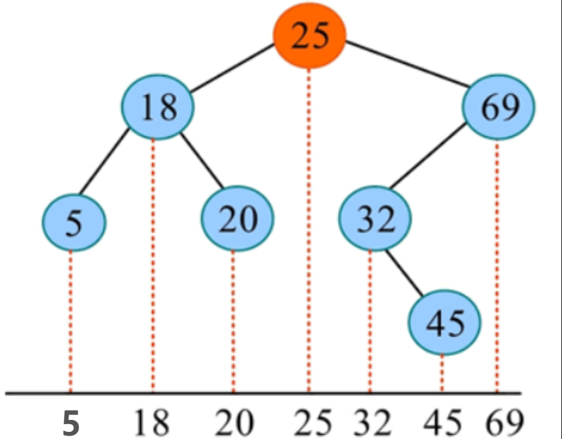
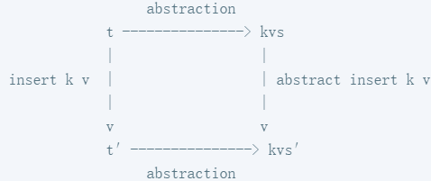

# Metamorphic Testing and Property-based Testing

Use property-based testing to validate the implementations of binary search trees.

## Objective

In this lab, you shall apply property-based testing to validate the implementations of binary search trees based on [Hypothesis](https://github.com/HypothesisWorks/hypothesis). Hypothesis is a popular property-based testing tool for Python. Through this lab, you will learn how to define different forms of properties for effective testing.

## Setup

Please install the Python packages `pytest` and `hypothesis` in your lab environment:

```bash
/lab4$ pip install -r requirements.txt  # Install the required packages
```

## Prerequisite

### Binary Search Tree (BST)

A Binary Search Tree (BST) is a rooted binary tree with specific ordering properties that enable efficient insertion, deletion, and search operations. 

For every node in the tree:

1. The key of all nodes in its left subtree is less than the node’s own key.

2. The key of all nodes in its right subtree is greater than the node’s own key.

3. The keys are typically unique.

Consequently, an in-order traversal—visiting nodes in the order of left, root, right—will always yield a sequence of keys in strictly ascending order, as illustrated in the following example.

<div align="center">

</div>

In this lab, `/lab4/src/BST.py` gives an implementation of binary search tree (BST). This BST implementation supports keys of any comparable type and values of any type, and four core operations `insert`, `delete`, `find`, and `union`. Please carefully read the code to understand the implementation.


### Hypothesis

Hypothesis is a Python library that implements property-based testing (PBT). PBT validates the correctness of a function (or a module or even a system) based on some given properties. It uses a wide array of automatically generated test cases rather than a single test case to effectively stress test this function. It would shrink and return counter-example inputs if some property violations are found.

In the code below, we illustrate how classic *example-based testing* to test a `sort` function (see `test_sort_by_example`) and how *property-based testing* (based on Hypothesis, see `test_sort_by_property`) to test this `sort` function. Here, this `sort` function sorts the numbers in the ascending order.

```python
# Example-based testing
def test_sort_by_example():
    input_list = [3, 1, -1] # feed single input
    output = sort(input_list)
    expected_output = [-1, 1, 3]
    assert output == expected_output # check single output
    
# Property-based testing based Hypothesis
# Automatically generate random lists of integers with 0 to 1000 elements.
@given(st.lists(st.integers(), min_size=0, max_size=1000))
def test_sort_by_property(input_list):
    # Pre-condition
    assume(len(input_list) > 1)
    
	sorted_list = sort(input_list)
    # Post-condition: validate the sorting property holds
    for i in range(len(sorted_list) - 1):
        assert sorted_list[i] <= sorted_list[i + 1]
```

#### Strategies

Strategies in Hypothesis are the data generators that automatically create diverse test inputs (with different types and forms) for your property-based tests. 

```python
from hypothesis import strategies as st

# Basic Type
st.integers()           # integer
st.floats()             # floating-point number  
st.text()               # Text
st.booleans()           # Boolean value

# Complex type
st.lists(st.integers()) # List of integers
st.dictionaries(st.text(), st.integers())  # Dictionary
st.tuples(st.integers(), st.text())        # Tuple

# Custom policy
st.one_of(st.integers(), st.text())        # One of several types
```

In this lab, `/lab4/src/test_strategies.py` has already implemented two strategies, i.e., `keys_strategy` and `trees_strategy`:

```python
keys_strategy = st.one_of(st.integers(min_value = -25, max_value = 25), st.integers())

def build_bst_from_tuples(kv_list: List[Tuple[int,int]]) -> BST[int,int]:
    bst: BST[int,int] = BST.nil()
    for k, v in kv_list:
        bst = bst.insert(k, v)
    return bst

trees_strategy = st.lists(
    st.tuples(keys_strategy, st.integers()),
    min_size = 0,
    max_size = 50,
    unique_by = lambda kv: kv[0]
).map(build_bst_from_tuples)
```

+ `keys_strategy`: It picks a key from a restricted range [-25, 25] or from the full integer range at random. 

>> The design purpose is: (1) The restricted range (-25 to 25) increases the probability of key collisions (same key appearing multiple times) to mimic real-world usage of BST; (2) The full range ensures you also test with diverse, widely-spaced keys. This design makes testing more effective by balancing collision scenarios with general cases.
 
+ `trees_strategy`: It generates random BST objects with up to 50 (key, value) pairs, and the keys are unique. 

>> Internally, this strategy uses the `insert` operation to add the nodes with (key, value) and build up the BST.


#### Shrinking

A key feature of Hypothesis is shrinking. If a test case fails, it doesn't just report the original complex input. Instead, it intelligently simplifies that input to the smallest form that still causes the failure, making it much easier to identify the underlying issue.

### Pytest

Pytest is a robust Python testing framework that simplifies test creation and execution. It features automatic test discovery, comprehensive error reporting, and a rich plugin ecosystem.

To get yourself familiar with Pytest, you can run `/lab4/tests/simple_test.py` which tests a buggy version of BST (corresponding to `lab4/bugs/bug1.py`):

```bash
/lab4/tests$ pytest simple_test.py -q --tb=no # Concise output results
```

You would obtain the following testing results which indicate 3 tests failed and 8 tests passed:

```tex
$ pytest simple_test.py -q --tb=no
...F..F..F.                                                                        [100%]
================================ short test summary info =================================
FAILED simple_test.py::test_three_inserted_values_can_be_found - AssertionError: assert None == 'twenty'
FAILED simple_test.py::test_a_deleted_value_can_no_longer_be_found - AssertionError: assert None == 'twenty'
FAILED simple_test.py::test_union_of_two_bsts_contains_keys_of_both - AssertionError: assert {(1, 'one'), ..., (5, 'five')} == {(1, 'one'), ..., (5, 'five')}
3 failed, 8 passed in 0.09s
```

If you want to obtain detailed results, you can run:

```bash
\lab4\tests$ pytest simple_test.py -v --tb=short # Detailed output results
```

## Lab Instructions

### Project Structure

```tex
.
|-- bugs
|   |-- __init__.py
|   |-- bug1.py # Bugs has been inserted into both find and union for detection by test1.
|   |-- bug2.py # Bugs has been inserted into both the delete and union for detection by test2.
|   |-- bug3.py # Bug has been introduced in the delete function for detection by test3.
|   `-- bug4.py # Bugs has been inserted into both the delete and union operations for detection by test4.
|-- requirements.txt
|-- src
|   |-- BST.py # Correct implementation of the BST data structure
|   |-- BSTUtils.py # Related utility functions
|   `-- __init__.py
`-- tests
    |-- conftest.py # Runtime Environment Configuration and Test Report Generation
    |-- hypothesis.ini # Hypothesis configuration
    |-- makefile # Run the scripts, including all, clean, test1, test2, test3, test4
    |-- simple_test.py # simple test for BST
    |-- test1.py # TODO: Write Validity Properties tests for find and delete.
    |-- test2.py # TODO: Write Postcondition Properties tests for delete and union.
    |-- test3.py # TODO: Write Metamorphic Properties tests for delete and union.
    `-- test4.py # TODO: Write Model-based Properties tests for delete and union.
```

### Bugs

| TODOS     | Property Type            | Target Methods    | Bugs to Identify     | Bug Description                                              |
| :-------- | :----------------------- | :---------------- | :------------------- | :----------------------------------------------------------- |
| **TODO1** | Validity Properties      | `find`, `union`   | **Bug1.py - BUG(1)** | In `find(key)`: Mistakenly assigning left subtree to right attribute |
|           |                          |                   | **Bug1.py - BUG(2)** | In `union(bst1, bst2)`: Mistakenly puting the bst1 as the bst2's left subtree |
| **TODO2** | Postcondition Properties | `delete`, `union` | **Bug2.py - BUG(1)** | In `delete(key)`: Mistakenly selecting the search path.      |
|           |                          |                   | **Bug2.py - BUG(2)** | In `union`: Mistakenly prioritizing bst2 over bst1 when their keys are identical |
| **TODO3** | Metamorphic Properties   | `delete`, `union` | **Bug3.py - BUG(1)** | In `delete(key)`: Mistakenly selecting the search path.      |
| **TODO4** | Model-based Properties   | `delete`, `union` | **Bug4.py - BUG(1)** | In `delete(key)`: Mistakenly selecting the subtree to delete |
|           |                          |                   | **Bug4.py - BUG(2)** | In `union(bst1, bst2)`: Mistakenly prioritizing bst2 over bst1 when their keys are identical |

### Validity Testing

Binary search trees should always satisfy a validity property no matter which operation (`insert`, `delete`, `find` and `union`) has been performed: *the keys in the tree should be ordered* --- for every node in the tree, (1) the key of all nodes in its left subtree is less than the node’s own key, and (2) the key of all nodes in its right subtree is greater than the node’s own key. 

For example, we can use this validty property to check the validity of the BST after `insert` and `delete` operations are executed.

```python
# An empty tree is a valid binary search tree.
def test_nil_valid() -> None:
    assert is_valid(BST.nil())

# After inserting a key-value pair, the result remains a valid BST.
@given(keys_strategy, st.integers(), trees_strategy)
def test_insert_valid(key: int, value: int, bst: BST[int,int]) -> None:
    assert is_valid(bst.insert(key, value))

# After deleting a key, the result remains a valid BST.
@given(keys_strategy, trees_strategy)
def test_delete_valid(key: int, bst: BST[int,int]) -> None:
    assert is_valid(bst.delete(key))
```

#### TODO1

In this section, you are required to define the preceding validity property in `lab4\src\BSTUtils.py` which checks the keys in a BST is always ordered.

Based on your defined validty property, you are required to validate whether the two core operations `find` and `union` respect the validity property respectively in `lab4\report\test1.py`. 
After that, you can run the following command to confirm whether the validity property can help find the two bugs in `lab4\bugs\bug1.py`.

```bash
lab4\tests$ make test1

# If you want more detailed output
lab4\tests$ pytest -v test1.py --tb=short
```

You should obtain the following testing results:

```tex
Run Validity Testing (test1.py)...
...FF
FAILED test1.py::test_find_valid - assert False
FAILED test1.py::test_union_valid - assert False
2 failed, 3 passed in 1.12s
```

### Postcondition Testing

A postcondition is a property or condition that must be true after a function/operation completes execution. It describes the guaranteed state or result when the function finishes. For example, after the operation `insert` is executed, the key just inserted should exist, and any original key should be unchanged.

```python
# Insertions should not affect the search results of other keys (including themselves).
@given(keys_strategy, st.integers(), trees_strategy, keys_strategy)
def test_insert_post(key: int, value: int, bst: BST[int,int], search_key:int) -> None:
    found = bst.insert(key, value).find(search_key)
    expected = value if key == search_key else bst.find(search_key)
    assert found == expected
```

For the operation `find`, we can also come up some postcondition properties. We know that a tree must contain a key if we have just inserted this key. Likewise, we know that a tree should not contain a key if we have just deleted this key. Thus we can write two postcondition properties for `find`:

```python
# After insertion, the lookup should return the inserted value.
@given(st.integers(), st.integers(), trees_strategy)
def test_find_post_present(key: int, value: int, bst: BST[int,int]) -> None:
    assert bst.insert(key, value).find(key) == value

# After deletion, the lookup should return None.
@given(st.integers(), trees_strategy)
def test_find_post_absent(key: int, bst: BST[int,int]) -> None:
    assert bst.delete(key).find(key) is None
```

#### TODO2

You are required to define some postcondition properties for the two core operations `delete` and `union` respectively in `lab4\report\test2.py`.
After that, you can run the following command to confirm whether your properties can help find the two bugs in `lab4\bugs\bug2.py`.

```bash
lab4\tests$ make test2

# If you want more detailed output
lab4\tests$ pytest -v test2.py --tb=short
```

You should obtain the following testing results:

```bash
Run Postconditions Testing (test2.py)...
.F.FF                                                                                       
FAILED test2.py::test_find_post_absent - assert 0 is None
FAILED test2.py::test_delete_post - assert 0 == None
FAILED test2.py::test_union_post - assert 1 == 0
3 failed, 2 passed in 4.10s
```

### Metamorphic Testing

Metamorphic testing is a successful approach to the oracle problem in many contexts. The basic idea is this: even if the expected result of a function call such as `tree.insert(key, value)` may be difficult to predict, we may still be able to express an expected relationship between this result, and the result of a related call. In this case, if we insert an additional key into `tree` before calling `insert(key, value)`, then we expect the additional key to appear in the result also. We formalize this as the following metamorphic property:

```python
# The relationship between the two insertion operations on (key1, value1) and (key2, value2) and the expected result
# If the key is identical, insert value2 (rather than value1); otherwise, insert both value1 and value2.
# the equivalent determining whether trees are equivalent while disregarding their structure
@given(keys_strategy, st.integers(), keys_strategy, st.integers(), trees_strategy)
def test_insert_metamorph_by_insert(key1: int, value1: int, key2: int, value2: int, bst: BST[int,int]) -> None:
    inserted = bst.insert(key1, value1).insert(key2, value2)
    expected = bst.insert(key2, value2) if key1 == key2 else bst.insert(key2, value2).insert(key1, value1)
    assert equivalent(inserted, expected)
```

`equivalent` is implemented in `lab4\src\BSTUtils`, serving to determine whether trees are equivalent while **disregarding their structural composition**.

```python
def equivalent(bst1: BST[K,V], bst2: BST[K,V]) -> bool:
    return set(bst1.to_list()) == set(bst2.to_list())
```

Note that the following logic is incorrect; please carefully compare it with the distinctions outlined above, The insertion principle in this experiment is **"the last insertion wins"**:

```python
@given(keys_strategy, st.integers(), keys_strategy, st.integers(), trees_strategy)
def test_insert_metamorph_by_insert(key1: int, value1: int, key2: int, value2: int, bst: BST[int,int]) -> None:
    inserted = bst.insert(key1, value1).insert(key2, value2)
    # The priority of value1 and value2 has not been considered.
    expected = bst.insert(key2, value2).insert(key1, value1)
    assert equivalent(inserted, expected)
```

#### TODO3

Following the approach of `insert`, write **Metamorphic Properties** tests for `delete` and `union` respectively to identify one bugs in `\bugs\bug3.py`.

For `delete`: To verify the outcome of the delete operation, one may establish a relationship between `delete.insert` and `insert.delete` by **adding an insert**. That is, by inserting before and after the deletion, one can determine whether the tree structures are equivalent.

For `union`: To verify the outcome of the union operation, one may establish a relationship by **adding an insert**. **Please note that we have not introduced bugs into the union, but the metamorphic properties of this union are prone to errors in implementation. Correct properties will not detect bugs.**

After that, Run the following command to detect whether the two bugs in `lab4\bugs\bug3` concerning `delete` and `union` have been identified.

```python
lab4\tests$ make test3

# If you want more detailed output
lab4\tests$ pytest -v test3.py --tb=short
```

You should obtain the following result and get the assert information and sharking test seed in `lab4\report\test3`:

```tex
Run Metamorphic Testing (test3.py)...
.F.                                                                                         
FAILED test3.py::test_delete_metamorph_by_insert - assert False
1 failed, 2 passed in 2.62s
```

### Model-based Properties Testing

In 1972, Hoare published an approach to proving the correctness of **data representations**(C. A. Hoare. Proof of correctness of data representations. Acta Inf., 1(4):271–281, December 1972.), by relating them to **abstract data** using **an abstraction function**.

In this experiment:

+ date representation: BST
+ abstraction function: `BST::to_list()`
+ abstract data: List[Tuple[K,V]]

```python
def to_list(self) -> List[Tuple[K,V]]:
        if self.is_leaf():
            return []
        return [self._entry] + self.get_left().to_list()  + self.get_right().to_list()
```

Taking the `insert` operation as an example:

<div align="center">

</div>

Inserting data into a BST should yield a set equivalent to inserting data into an abstract data.

```python
@given(keys_strategy, st.integers(), trees_strategy)
def test_insert_model(key: int, value: int, bst: BST[int,int]) -> None:
    abstract_data = bst.to_list()
    inserted_abstract_data = abstract_data.copy()
    flag = False
    for i, (k, v) in enumerate(inserted_abstract_data):
        if k == key:
            True
            inserted_abstract_data[i] = (key, value)
            break
    if flag is False:
        inserted_abstract_data += [(key, value)]
    inserted_bst = bst.insert(key, value)
    assert set(inserted_bst.to_list()) == set(inserted_abstract_data)
```

**Summary: A model-based property tests a single function by making a single call, and comparing its result to the result of a related “abstract operation” applied to related abstract arguments. An abstraction functions maps the real, concrete arguments and results to abstract values, which we also call the “model”.**

#### TODO4

Following the approach of `insert`，Write **Model-based Properties** tests for delete and union respectively to identify one bugs in `\bugs\bug4.py`:

+ For `delete`, Perform a delete operation on the BST and abstract data structure, then determine whether the final sets are equivalent.

+ For `union`, Perform a union operation on two BSTs and their corresponding abstract data structures, then determine whether the resulting union is equivalent.

After that, Run the following command to detect whether the two bugs in `lab4\bugs\bug2` concerning `delete` and `union` have been identified.

```python
lab4\tests$ make test4

# If you want more detailed output
lab4\tests$ pytest -v test4.py --tb=short
```

You should obtain the following result and get the assert information and sharking test seed in `lab4\report\test4`:

```bash
Run Model-based Properties Testing (test4.py)...
..FF                                                                                      
FAILED test4.py::test_delete_model - assert {(0, 0), (1, 0)} == {(1, 0)}
FAILED test4.py::test_union_model - assert {(0, 1)} == {(0, 0)}
2 failed, 2 passed in 0.99s
```

## Submission

**Warning: We shall verify whether your code logic complies with the specifications outlined in TODO. Should your approach be bug-oriented or answer-oriented, points will be deducted accordingly.**

Once you are done with the lab, submit your code by commiting and pushing the changes under `lab2/`. Specifically, you need to submit the changes to `lab4/tests/test1.py` , `lab4/tests/test2.py` , `lab4/tests/test4.py` ,  `lab4/tests/test4.py` .

```bash
   lab4$ git add tests/test1.py tests/test2.py tests/test3.py tests/test4.py
   lab4$ git commit -m "your commit message here"
   lab4$ git push
```

